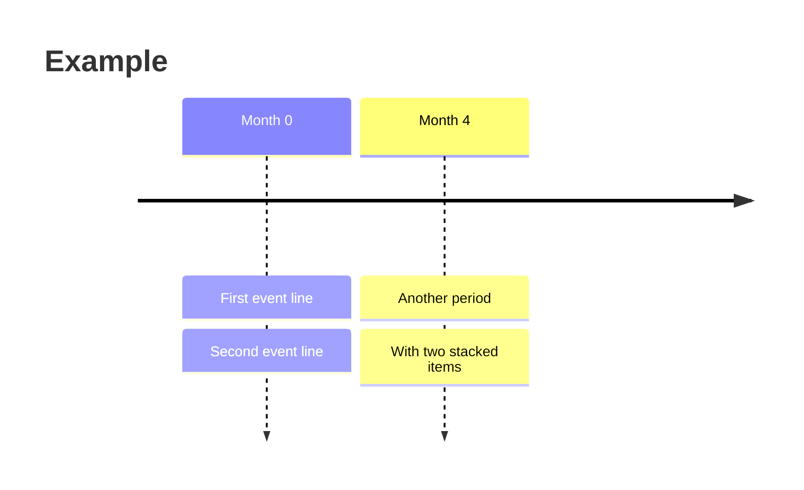
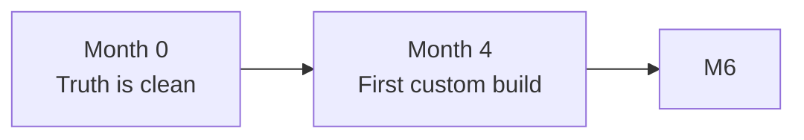

# mermaid-diagrams

Make ` ```mermaid ` code blocks in markdown render as themed, clickable, zoomable diagrams. Client-side rendering; works on every host with zero deploy gymnastics.

## When to invoke this skill

The user is asking for any of:
- "Add mermaid to my blog / docs site"
- "Mermaid diagrams aren't rendering / show as raw text"
- "Make mermaid match my theme" / "themed mermaid"
- "Mermaid in dark mode looks bad"
- "Click-to-zoom for diagrams"
- A markdown post in their repo contains ` ```mermaid ` fences that ship as code blocks

## Why client-side, not SSR

**Do not propose `mermaid-isomorphic` / `rehype-mermaid` / Playwright.** It's a well-known dead-end on managed hosts: the build can install Chromium binaries but can't install the system libs Chromium needs (libnss3, libx11, etc.) without root. Renders fail at build time, the throw cascades through Astro's markdown pipeline, and **the entire post body silently goes blank** — title and chrome render fine, every paragraph and diagram disappears. Multiple blog posts have documented this same trap.

Client-side avoids all of it: lazy-load the mermaid lib from a CDN, render in the browser, re-render on theme toggle. Tradeoffs:

- **Cost**: ~200KB gzipped JS, only on pages with diagrams, lazy-loaded after first paint. ~150ms render delay.
- **Win**: works on every host; deploys can never break over a Chromium binary; theme switching is dynamic; Convinced and many other production apps use this exact pattern at scale.

## One-shot setup (Astro)

For Astro, do all six steps in one pass. For other stacks see `references/non-astro-ports.md`.

### 1. Copy the four assets into the project

| From skill | To project |
|---|---|
| `assets/remark-mermaid.ts` | `src/utils/remarkMermaid.ts` |
| `assets/mermaid-client.ts` | `src/utils/mermaidClient.ts` |
| `assets/mermaid-styles.css` | append to `src/styles/global.css` (or a CSS file imported globally) |
| `assets/lightbox.html` | paste once near the bottom of the post layout (e.g. `src/layouts/PostDetails.astro`, just before `</Layout>`) |
| `assets/lightbox.js` | paste inside `<script is:inline data-astro-rerun>` in the post layout |

The CSS uses Tailwind v4 utility classes via `@apply` and references `--background`, `--foreground`, `--accent`, `--muted`, `--border` CSS variables. If the project doesn't have those, map them to whatever exists OR strip the `@apply` lines and replace with plain CSS.

### 2. Register the remark plugin in `astro.config.ts`

```ts
import { remarkMermaid } from "./src/utils/remarkMermaid";

export default defineConfig({
  markdown: {
    remarkPlugins: [
      remarkMermaid,
      // ...keep any existing plugins after this
    ],
  },
});
```

Order matters: `remarkMermaid` must run before any other plugin that touches code blocks. It converts ` ```mermaid ` blocks into raw `<pre class="mermaid">{source}</pre>` HTML so the source survives Shiki and reaches the browser.

### 3. Wire the renderer into the post layout

In the post layout (e.g. `src/layouts/PostDetails.astro`), add a `<script>` block — NOT `is:inline` — that imports the renderer:

```astro
<script>
  import { initMermaidClient } from "@/utils/mermaidClient";
  initMermaidClient();
  document.addEventListener("astro:page-load", () => initMermaidClient());
</script>
```

This script is bundled by Astro/Vite. The `astro:page-load` listener handles view-transition navigation.

### 4. (Already done in step 1) The lightbox modal markup + script

Make sure the lightbox `<script>` IS marked `is:inline data-astro-rerun` so it runs on every page navigation.

### 5. Verify

Build (`pnpm build`) should succeed with zero new errors. Open a post with a `mermaid` block in the dev server: the block should briefly flash as faded code, then render as a themed SVG figure. Click it → zoom modal. Toggle theme → diagram re-renders in the new palette.

### 6. Tell the user the authoring rule

In their markdown, they should:
- Use ` ```mermaid ` fences as normal
- Use semantic class names on nodes (`:::src`, `:::store`, `:::agent`, `:::bad`, `:::heading`, etc.) — see palette table below
- **Not** write `classDef name fill:#xxx,...` lines — the renderer strips them and owns the colors itself

## The palette (semantic, theme-aware)

The renderer ships a curated 6-color palette with light + dark variants. Each `:::className` reference in the user's markdown maps to a slot:

| Slot | Light | Dark | Class names |
|---|---|---|---|
| **purple** | lavender | deep purple | src, source, sources, input, ing, ingestion, new |
| **cream** | sand | dark amber | store, storage, data, cache, db, wiki, old, field |
| **mint** | mint | forest green | agent, compute, success, good, pass, verified, approved, surf, has |
| **peach** | peach | bronze | out, output, bad, error, fail, conflict, catch, warn, miss |
| **blue** | sky | deep navy | decision, judge, route, branch, rec, bsys |
| **rose** | pink | dark rose | heading, title, highlight, important |
| **neutral** | grey | dark grey | (any unmapped class) |

To add a class name → slot mapping or change colors, see `references/customizing-the-palette.md`.

## Authoring tips (for the user)

- **Two unrelated graphs in one diagram render side-by-side** — split them into two separate ` ```mermaid ` blocks. Mermaid lays disconnected components horizontally regardless of `flowchart TB` orientation.
- **`<br/>` works in `flowchart` node labels but NOT in `timeline` events** — see Gotcha 7 below. `flowchart` labels render `<br/>` as a line break; `timeline` events render it as literal text.
- **Avoid `\n` inside backtick markdown labels** — mermaid's parser renders `\n` as the literal letter `n` ("abetter" instead of "a / better"). The renderer strips this for you, but `<br/>` is cleaner if you author it.

## Gotchas (client-side specific — these still bite)

### 1. Tailwind Typography prose `<p>` margin clips foreignObject labels

**Symptom**: Single-line node labels (e.g. `["Slack threads"]` with no `<br/>`) render as empty boxes. Two-line labels render fine.

**Cause**: Tailwind Typography's `.prose p { margin: 1.25em 0 }` (~20px top + 20px bottom) leaks into mermaid's `<foreignObject>` HTML labels. Single-line foreignObjects are ~22.5px tall — 40px of margin completely clips the text.

**Fix**: The CSS in `assets/mermaid-styles.css` already includes a reset for `figure.mermaid-wrap foreignObject p/span/div { margin: 0 !important }`. If you stripped that block, put it back.

### 2. Disconnected components render side-by-side

**Symptom**: A diagram with two unrelated trees (e.g. comparing two systems) renders as one giant horizontal layout, illegibly small.

**Cause**: Mermaid's layout engine puts disconnected subgraphs side by side regardless of `flowchart TB`/`LR`.

**Fix**: Split into two ` ```mermaid ` blocks with a sub-heading between them. Each renders as its own figure, naturally stacked.

### 3. `\n` inside backtick markdown labels renders as literal "n"

**Symptom**: Label like `"\`a\nbetter\`"` shows up as **"abetter"** in the diagram.

**Cause**: Mermaid's parser reads `\n` as two literal characters (the `\` gets dropped silently).

**Fix**: The renderer's `stripBacktickNewlines()` handles this for you (replaces `\n` → space inside backticks). Authoring in `<br/>` is cleaner if you control the source.

### 4. Stripping classDef without a replacement palette = uniform grey diagrams

**Symptom**: Every node is the same color, no semantic differentiation.

**Cause**: Stripping user `classDef` lines without injecting fresh ones makes mermaid fall back to `mainBkg` for every node.

**Fix**: The renderer's `injectClassDefs()` handles this — strips user classDefs, then emits fresh `classDef name fill:X,stroke:Y,color:Z` lines per referenced class using the active theme's palette. Don't disable this.

### 5. Vite tries to bundle the dynamic mermaid CDN import

**Symptom**: Build error like "Failed to resolve import 'https://cdn.jsdelivr.net/...'" or the bundle including all of mermaid.

**Cause**: Vite tries to resolve and bundle dynamic `import()` calls by default.

**Fix**: The renderer uses `import(/* @vite-ignore */ MERMAID_CDN)` so Vite leaves it alone and the browser fetches it at runtime. Don't remove the comment.

### 7. `<br/>` renders as literal text inside `timeline` events

**Symptom**: A `timeline` diagram shows `Month 0 : Truth is clean<br/>'SAP supported'` with the `<br/>` printed verbatim in the rendered output instead of breaking the line. The two halves end up running together with `<br/>` visible.

**Cause**: Mermaid's `timeline` diagram type does NOT pass event text through the HTML/foreignObject label pipeline that `flowchart` uses. Timeline events go through a plain-text renderer that escapes HTML. `<br/>` only works in node labels of the diagram types that use foreignObject (`flowchart`, `graph`, `classDiagram`, `stateDiagram`).

**Fix**: Use mermaid's native multi-event syntax for timelines — extra `: text` separators stack as multiple boxes under the same period:



Each `: chunk` after the first becomes its own box stacked vertically under the period. This is the equivalent of a line break in `timeline`.

Also: avoid colons inside event text. Mermaid's timeline parser treats every `:` as a new-event separator, so `'SAP S/4HANA: supported'` becomes two events (`'SAP S/4HANA` and `supported'`). Drop the inner colon or replace with a dash/comma.

**About the dashed vertical connectors and downward arrowheads in `timeline`**: every `timeline` diagram renders period boxes on top, a horizontal axis arrow, dashed lines from each period down through its events, and an arrowhead at the bottom of each column. That's mermaid's native visual signature for timelines — and per the [official Mermaid timeline docs](https://mermaid.js.org/syntax/timeline.html), there is **no built-in option** to hide those connectors or arrowheads. The only theme variables exposed are `cScale0`–`cScale11` (background colors), `cScaleLabel0`–`cScaleLabel11` (foreground colors), and `disableMulticolor` (uniform vs per-period coloring).

That makes `timeline` a **bad fit for a chronological narrative inside a longer post that uses other flowcharts** — the loose-ended dashed arrows clash visually with neighboring `flowchart` blocks, and there's no clean way to fix it.

**Strong recommendation for prose-heavy posts: use `flowchart LR` instead of `timeline`.** Each period becomes a node with a multi-line label (`<br/>` works in flowchart), and they chain with `-->` arrows. Same horizontal-narrative effect, no loose ends, visually consistent with the rest of the post:



When `timeline` IS the right choice: standalone diagrams in slides or technical docs where the period/event distinction is the whole point and the dashed connector is the expected visual. Avoid it inside a post that already has 4+ flowcharts.

If a user insists on keeping `timeline` and removing the connectors, the only path is CSS overrides on the rendered SVG. Selectors drift between mermaid versions; use browser devtools to find the right ones for the version pinned in `mermaid-client.ts` (current: 11.14.x).

**Quick reference table** for what works in label text by diagram type:

| Diagram type | `<br/>` | `\n` | Multi-line via `:` |
|---|---|---|---|
| `flowchart` / `graph` | ✅ | ❌ (renders as "n") | n/a |
| `classDiagram` | ✅ | ❌ | n/a |
| `stateDiagram` | ✅ | ❌ | n/a |
| `sequenceDiagram` | ✅ (in `Note over`) | ❌ | n/a |
| `timeline` | ❌ (literal text) | ❌ | ✅ (use this) |
| `gantt` | ❌ | ❌ | n/a (single-line only) |
| `pie` | ❌ | ❌ | n/a |
| `journey` | ❌ | ❌ | n/a |

### 8. Theme toggle leaves diagrams in the old palette

**Symptom**: User clicks dark/light toggle; diagrams stay in the previous theme.

**Cause**: Mermaid bakes colors into the SVG at render time. CSS overrides can't beat baked-in `<style>` blocks.

**Fix**: The renderer caches the original source on each figure as `data-mermaid-source` and a `MutationObserver` on `<html>[data-theme]` re-runs `renderAll()` on toggle. Don't break that observer.

## File reference

```
mermaid-diagrams/
├── SKILL.md                          ← this file
├── assets/
│   ├── remark-mermaid.ts             ← Astro/unified remark plugin
│   ├── mermaid-client.ts             ← client-side renderer + palette
│   ├── mermaid-styles.css            ← figure + lightbox styles
│   ├── lightbox.html                 ← modal markup
│   └── lightbox.js                   ← lightbox script
└── references/
    ├── customizing-the-palette.md    ← change colors / add slots
    └── non-astro-ports.md            ← Next, Eleventy, Hugo notes
```

The whole skill is ~700 lines of code. After the one-shot setup, the user has themed mermaid + zoom modal forever.
